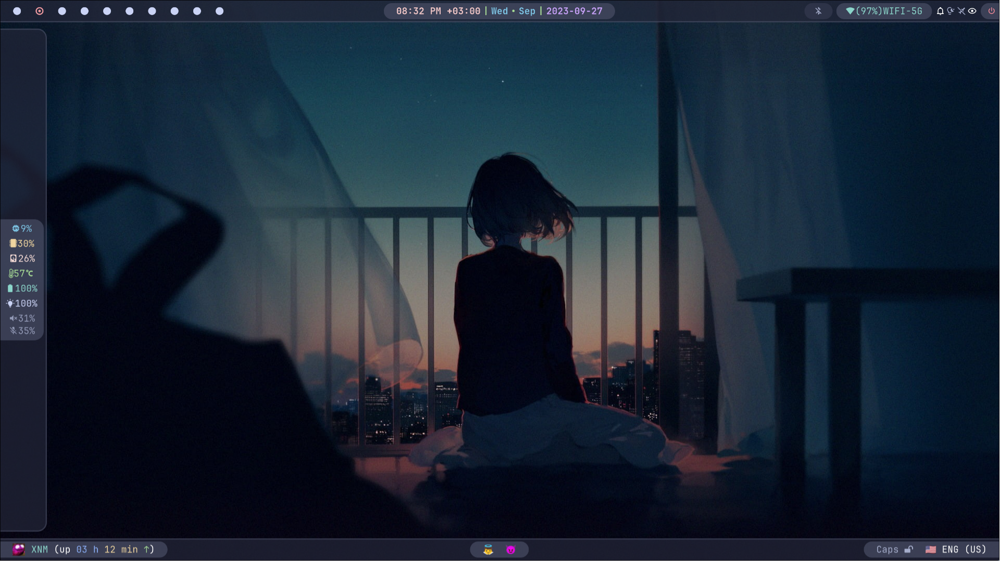
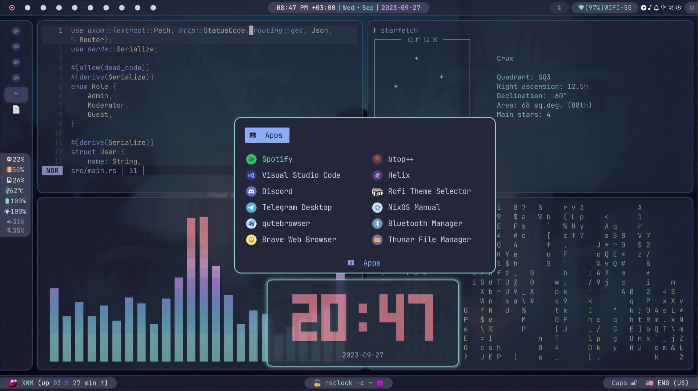
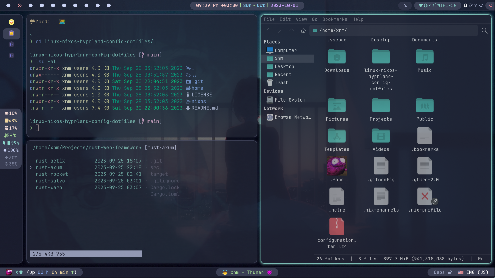
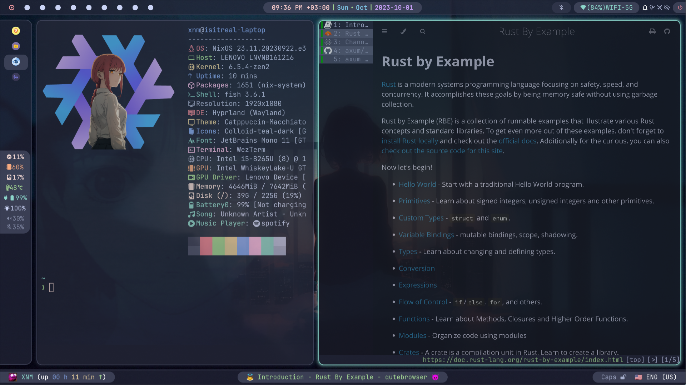

<div align="center"></div>
<h1 align="center">NixOS & Hyprland with Catppuccin Macchiato Theme Configuration</h1>

<div align="center">


</div>


## Table of Contents
- [About](#-about)
- [Showcase](#-showcase)
- [Components](#-components)
- [Features](#-features)
- [Installation](#-installation)
- [Keybindings](#️-keybindings)
- [Useful aliases in Fish Shell](#-useful-aliases-in-fish-shell)
- [AI Tools and Services](#-ai-tools-and-services)
- [Useful info for Rustaceans](#-useful-info-for-rustaceans)
- [Yubikey on NixOS](#-yubikey-on-nixos)
- [License](#-license)

## 📖 About

This repository houses my NixOS Linux ❄️ flake configuration, featuring the Hyprland window manager and adorned with the stylish Catppuccin Macchiato theme. I rely on this setup as my daily driver for work and programming, primarily in Rust 🦀. Feel free to utilize it in its entirety or borrow specific components for your own configuration.

> [!NOTE]
> It's essential to note that this configuration is not minimalistic or lightweight and may require some disk space and knowledge to understand. If you're looking for something simpler, this configuration may not be suitable for you.

This system leverages cutting-edge channels and versions of software to provide you with the latest updates and features. Notably, it utilizes:

- **flake** (An experimental feature of the Nix package manager)
- ~~**nur** (The Nix User Repository)~~ *currently disabled
- **nixpkgs**: unstable
- **rust**: nightly version

This approach ensures that you stay on the forefront of technology, receiving the most recent software advancements promptly.
> [!WARNING]
> However, it's important to note that this emphasis on bleeding-edge software may impact the stability of the system.

> [!IMPORTANT]
> Please note that the system utilizes **Podman** instead of **Docker** for containerization due to various reasons, primarily related to security (rootless and daemonless containers), easier migration to Kubernetes, availability of pods, compatibility with systemd, and better security for `distrobox`. If you prefer to use **Docker** instead of **Podman**, you can make the switch by commenting out the **Podman** section in the `nixos/virtualisation.nix` file and uncommenting the **Docker** section. More details on **Docker** configuration in NixOS can be found [here](https://nixos.wiki/wiki/Docker).

> [!NOTE]
> The system also enables SELinux patches, as well as AppArmor and Tomoyo Linux Security Modules. It includes security daemons such as Fail2Ban and USBGuard, with Firejail preinstalled to meet your security requirements.

You have the flexibility to customize these configurations according to your needs by modifying the respective configuration files.

## 🌟 Showcase

> [!IMPORTANT]
> The showcased images do not reflect the latest version of the system's appearance. The final setup may vary slightly.





[Showcase Video](home/Videos/Records/record.mp4)

## 🔧 Components

| Component             | Version/Name                |
|-----------------------|-----------------------------|
| Distro                | NixOS                       |
| Kernel                | Zen                         |
| Shell                 | Fish                        |
| Display Server        | Wayland                     |
| WM (Compositor)       | Hyprland                    |
| Bar                   | Waybar                      |
| Notification          | Dunst                       |
| Launcher              | Rofi-Wayland                |
| Editor                | Helix                       |
| Terminal              | Kitty + Starship          |
| OSD                   | Avizo                       |
| Night Gamma           | Wlsunset                    |
| Fetch Utility         | Neofetch                    |
| Theme                 | Catppuccin Macchiato        |
| Icons                 | Colloid-teal-dark, Numix-Circle |
| Font                  | JetBrains Mono + Nerd Font Patch |
| Player                | Youtube Music + Spotify     |
| File Browser          | Thunar + Yazi               |
| Internet Browser      | Qutebrowser, Brave + Vimium + NightTab + Stylus |
| Mimetypes             | MPV, Imv, Zathura            |
| Image Editor          | Swappy                      |
| Screenshot            | Grim + Slurp                |
| Recorder              | Wl-screenrec                 |
| Color Picker          | Hyprpicker                  |
| Clipboard             | Wl-clipboard + Cliphist + Wl-clip-persist    |
| Idle                  | Hypridle                    |
| Lock                  | Hyprlock                    |
| Logout menu           | Wlogout                     |
| Wallpaper             | Hyprpaper                   |
| Graphical Boot        | Plymouth + Catppuccin-plymouth |
| Display Manager       | Greetd + Tuigreet           |
| Containerization      | Podman                      |

And many other useful utilities. The full list can be found in the system configuration files at `nixos` directory.

## ✨ Features

- 🔄 **Reproducible**: Built on NixOS, this configuration can be effortlessly reproduced on other machines, ensuring a consistent setup.

- 🖌️ **Consistent**: Nearly every component has been meticulously styled to adhere to the Catppuccin Macchiato theme, providing a visually cohesive experience.

- ✅ **Complete**: This system is equipped with a wide range of components and utilities, akin to the completeness of operating systems like MacOS or Windows.

- 🎨 **Customizable**: Leveraging the power of Linux and Hyprland, this configuration offers extensive customization options, allowing you to tailor your setup to your preferences.

## 🚀 Installation

1. Download and Install NixOS from the [official site](https://nixos.org/download).
2. Temporarily install ripgrep and fish using the command: `nix-shell -p ripgrep fish --run fish`. You can also use classic bash and grep for the next step without installing fish and ripgrep.
3. Run the command `rg --hidden FIXME` and change/add lines to match your device, swaps, partitions, peripherals, file systems, etc. in the configuration files. 

> [!IMPORTANT]
> Ensure that you configure USBGuard in the `nixos/usb.nix` file to avoid potential issues. By default, USBGuard blocks all USB devices, which can lead to the disabling of crucial hardware components such as the integrated camera, bluetooth, wifi, etc. To configure USBGuard properly, add your trusted USB devices to the configuration. You can obtain a list of all connected devices by using the `lsusb` command from the `usbutils` package.

> [!WARNING]
> Failure to configure USBGuard appropriately may result in the inability to connect any USB devices to your machine. If needed, you can also disable USBGuard altogether by setting `services.usbguard.enable` to `false` in the configuration:`services.usbguard.enable = false;`. This step ensures that USBGuard is not actively blocking any USB devices.

> [!IMPORTANT]
> Remember to update the monitor settings in the Hyprland configuration file located at `home/.config/hypr/hyprland.conf`.

> [!IMPORTANT]
> Also, important: If you use disk encryption with LUKS and want to use encrypted swap, you need to enable swap on LUKS. This is usually auto-generated in `/etc/nixos/configuration.nix` as the `boot.initrd.luks.devices."luks-...".device = "/dev/disk/by-uuid/...";` code block, if you set this option up during the NixOS installation process. You can simply copy this snippet to either `nixos/swap.nix`, `nixos/hardware-configuration.nix`, or `nixos/configuration.nix` (Personally, I prefer to copy it to `hardware-configuration.nix`).
> Alternatively, you can set it up manually or use [swap encryption with a random key](https://nixos.wiki/wiki/Swap#Encrypt_swap_with_random_key).

4. To change the default username and/or hostname, run the command `rg --hidden 'xnm'` to find and fix all instances of the username, and `rg --hidden 'isitreal-laptop'` for the hostname.
> [!IMPORTANT]
> Make sure to change the username to match yours set during installation to avoid login issues.

> [!IMPORTANT]
> Also, don't forget to delete or change to my git settings in `home/.gitconfig`, `home/projects/.gitconfig.personal`, `home/.ssh/config`, and `home/work/.gitconfig.work` files, as they are configured for my personal use.

5. Enable `flake` support (more [here](https://nixos.wiki/wiki/Flakes#Enable_flakes_temporarily)) on your current system. Don't forget to run `sudo nixos-rebuild switch` after enabling `flake` in your `/etc/configuration.nix`.
6. Copy or move all files (with replacements) from the `home` directory to your `$HOME` directory in Linux.
7. Copy or move all files (with replacements and **sudo** permissions) from the `nixos` directory to `/etc/nixos/`.

> [!IMPORTANT]
> Ensure that `system.stateVersion = "your_version";` is correctly set to the release version of the initial installation of your system in the `configuration.nix` file.

> [!IMPORTANT]
> Also, for security reasons, ensure all files in the `/etc/nixos` directory are owned by **root**. If not, change ownership using the command: `sudo chown -R root:root /etc/nixos`.

8. Run the command `sudo nix flake update --flake /etc/nixos; and sudo nixos-rebuild switch --flake /etc/nixos#your-hostname --upgrade` or `nswitchu`. If you chose first command, replace `your-hostname` with your hostname before running the command; by default, hostname is set to `isitreal-laptop`.
9. Post-installation configuration:

 - Import GNOME settings along with the theme by executing the following command: `dconf load / < home/.config/gnome_settings_backup.dconf`. Additionally, you can use tools like **gnome-tweaks** or **themechanger** to fine-tune specific theme preferences to your liking.

 - Install dictionaries for spellchecking in Qutebrowser by using the similar command in **bash**: `$(find $(nix-store --query --outputs $(which qutebrowser)) -iname '*dictcli.py*' | head -1) install en-US hi-IN`.
  To obtain a list of all available dictionaries, run: `$(find $(nix-store --query --outputs $(which qutebrowser)) -iname '*dictcli.py*' | head -1) list` in **bash**. 
  For more information, visit [the Qutebrowser page on the nixos wiki](https://wiki.nixos.org/wiki/Qutebrowser).

 - Apply Catppuccin theme for websites in your browser (Brave, Firefox, Chromium):
   - Install the Stylus Extension from its [official website](https://add0n.com/stylus.html).
   - Open the extension's settings page and navigate to the Backup section.
   - Click "Import" and select the file `home/.config/stylus-catppuccin.json`.

 - Apply Catppuccin theme for Cool-Retro-Term:
   - Launch Cool-Retro-Term.
   - Right-click on the window and select "Settings".
   - In the General panel, click "Import" and select the file `home/.config/cool-retro-term-style.json`.
   - Select the imported profile named "catppuccin-theme".
   - Click "Load" and exit from "Settings".

 - Apply Open-WebUI Settings
    - Navigate to the Open-WebUI page: `http://localhost:8888`.
    - Signup or signin if you haven't already done so.  
    - Click on the user photo in the top-right corner.
    - From the dropdown menu, select "Admin Panel".
    - In the Admin Panel, go to the "Settings" tab.
    - Under the Settings tab, locate and click on the "Database" section.
    - Click "Import Config from JSON File" and select the configuration file: `home/.config/open-webui-config.json` from your file manager.

  - Login to your accounts.

  - Customize graphical applications to suit your preferences.

  After this, you will have a complete system.

## ⌨️ Keybindings

### Main

| Key Combination        | Action                       |
|------------------------|------------------------------|
| ALT + R                | Resize windows mode          |
| ALT + M                | Move windows mode            |
| SUPER + H, J, K, L/Arrows     | Change window focus   |
| SUPER + 1..0           | Change workspace (1-10)      |
| SUPER + ALT + 1..0     | Change workspace (11-20)|
| SUPER + SHIFT + 1..0   | Move window to workspace (1-10) |
| SUPER + SHIFT + ALT + 1..0   | Move window to workspace (11-20) |
| SUPER + SHIFT + Q      | Kill active window           |
| SUPER + SHIFT + F      | Toggle floating window       |
| SUPER + CTRL + F       | Toggle full-screen           |
| SUPER + SHIFT + O      | Toggle split                 |
| SUPER + SHIFT + P      | Toggle pseudo                |
| SUPER + SHIFT + M      | Exit from `hyprland`         |
| SUPER + CTRL + E       | Expose all windows using `pyprland` |
| SUPER + CTRL + M       | Expose all minimized windows using `pyprland` |
| SUPER + M              | Minimize or restore a window using `pyprland` |
| SUPER + CTRL + T       | Launch scratchpad with `wezterm` using `pyprland` |
| SUPER + CTRL + V       | Launch scratchpad with `pavucontrol` using `pyprland` |
| SUPER + T              | Launch `wezterm`             |
| SUPER + D              | Launch `rofi -drun`          |
| SUPER + B              | Launch `qutebrowser`         |
| SUPER + SHIFT + B      | Launch `brave`               |
| SUPER + F              | Launch `thunar`              |
| SUPER + ESCAPE         | Launch `wlogout`             |
| SUPER + S              | Launch `spotify`             |
| SUPER + Y              | Launch `youtube-music`       |
| SUPER + SHIFT + D      | Launch `discord`             |
| SUPER + SHIFT + T      | Launch `telegram`            |
| SUPER + SHIFT + L      | Launch `hyprlock`            |
| SUPER + SHIFT + S      | Take screenshot              |
| SUPER + E              | Launch `swappy` to edit last taken screenshot |
| SUPER + R              | Record screen area (MP4)     |
| SUPER + SHIFT + R      | Record screen area (GIF)     |
| SUPER + C              | Launch color picker (using `hyperpicer`) |
| SUPER + Z              | Toggle Zoom (with `pyprland`)|
| SUPER + V              | Launch clipboard menu (`rofi -dmenu`) |
| SUPER + SHIFT + V      | Launch clipboard menu (`rofi -dmenu`) (copy to clipboard) |
| SUPER + X              | Launch clipboard deletion item menu (`rofi -dmenu`) |
| SUPER + SHIFT + X      | Clear clipboard             |
| SUPER + U              | Launch bookmark menu (`rofi -dmenu`) |
| SUPER + SHIFT + U      | Add text from clipboard to bookmark |
| SUPER + CTRL + U       | Launch bookmark deletion item menu (`rofi -dmenu`) |
| SUPER + SHIFT + A      | Toggle airplane mode        |
| SUPER + SHIFT + N      | Toggle notifications        |
| SUPER + SHIFT + Y      | Toggle bluetooth            |
| SUPER + SHIFT + W      | Toggle wifi                 |
| SUPER + P              | Toggle play-pause player    |
| SUPER + ]              | Player next track           |
| SUPER + [              | Player previous track       |

You can find all other keybindings in `/home/.config/hypr/hyprland.conf` in the bind section. All system fish scripts are located at `/home/.config/fish/functions` directory.

## 🐟 Useful aliases in Fish Shell

This system includes a fish shell configuration file (`/home/.config/fish/config.fish`) that provides various aliases to enhance your experience working with it.

Common commands:
- `cl`: clear the terminal screen (shorthand for `clear`)
- `lgit`: launch the `lazygit` command-line Git client
- `ldocker`: launch the `lazydocker` command-line Docker client
- `conf`: navigate to the `~/.config` directory

NixOS-specific commands:
- `nswitch`: rebuild your system using the current flake
- `nswitchu`: rebuild and update your system using the current flake
- `nau`: add the unstable channel to the package manager
- `nsgc`: optimize the nix store and remove unreferenced and obsolete store paths (equivalent to `sudo nix-store --gc`)
- `ngc`: delete all old generations of user profiles (equivalent to `sudo nix-collect-garbage -d`)
- `ngc7`: delete generations of user profiles older than 7 days (equivalent to `sudo nix-collect-garbage --delete-older-than 7d`)
- `ngc14`: delete generations of user profiles older than 14 days (equivalent to `sudo nix-collect-garbage --delete-older-than 14d`)
- `nixos`: navigate to the `/etc/nixos` directory
- `store`: navigate to the `/nix/store` directory

You can customize this configuration by adding more aliases to the file and editing existing ones. This makes your experience more personalized and smoother.

## 🤖 AI Tools and Services

This configuration includes several AI/LLM tools and services for local development and experimentation:

**Local AI Services:**
- **Ollama** - Local LLM server with pre-loaded models:
  - Accessible at `http://localhost:11434`
  - Models: `llama3.2:3b`, `llama3.2-vision:11b`, `phi4:14b`, `deepseek-r1:7b`, `dolphin3:8b`, `smallthinker:3b`
  - Text embedding model: `nomic-embed-text`
  - CUDA acceleration enabled for GPU inference
  
- **SearXNG (Searx fork)** - Privacy-respecting meta search engine:
  - Accessible at `http://localhost:7777`
  - Supports HTML and JSON formats
  - 🔒 Remember to set `SEARX_SECRET_KEY` in your environment file: `home/.config/.env.searxng`

- **Open WebUI** - Local ChatGPT-style UI for Ollama:
  - Accessible at `http://localhost:8888`
  - Modern web interface with conversation history
  - Supports model switching and prompt templates

**AI Tools:**
- `aichat` - ChatGPT-like CLI and REPL with lot of features
- `aider-chat` - Code assistant/chat directly in the terminal
- `alpaca` - GUI LLM client with markdown support
- `oterm` - TUI LLM client with markdown support

> [!NOTE]
> These AI services are enabled by default.

To disable them:
1. Edit `nixos/llm.nix`
2. Disable services by setting their `enable` attribute to `false`:
   ```nix
   services.ollama.enable = false;
   services.searx.enable = false;
   services.open-webui.enable = false;
   ```
3. Remove AI CLI tools from `environment.systemPackages` if desired
4. Rebuild your configuration with `nswitch`

## 🦀 Useful info for Rustaceans

Here are some tips to enhance your Rust experience on this system:

1. **Installation Customization:**
   This system utilizes [rust-overlay](https://github.com/oxalica/rust-overlay) for Rust installation using the Nix approach. To customize the installation, including modifications to compilation targets, components, channels, or profiles, follow these steps:

   - Locate the `nixos/rust-toolchain.toml` file and make the necessary adjustments based on your requirements.

   - If you are working on multiple projects with distinct `rust-toolchain.toml` files or need to switch between stable and nightly Rust versions, consider the following options:
   
     - Set up a Nix environment using `flake.nix` and [rust-overlay](https://github.com/oxalica/rust-overlay) for each project separately. Utilize `nix develop` or `direnv` to manage project-specific Rust environments.

     - Alternatively, you can install `rustup` through `environment.systemPackages` and nixpkgs for a system-wide Rust setup. This allows you to manage Rust versions globally through `rustup`.

2. **Troubleshooting Compilation Issues:**
   If you encounter issues during Rust compilation, particularly those related to OpenSSL, SQLite, Wayland, or any other program utilized by `pkg-config` in the compilation process (see [here](https://nixos.wiki/wiki/Rust#Building_Rust_crates_that_require_external_system_libraries)), you can employ the `nix-shell -p pkg-config {your_dependency} [other_dependencies] --run fish` command. This command opens a Nix shell with the necessary dependencies, facilitating seamless code compilation. Alternatively, you can employ the approach outlined in the initial section (Installation Customization) by utilizing `flake.nix` with dev shell instead of `nix-shell`.
   Moreover, when using the Nix Dev shell, be aware that the compilation takes place in the runtime directory, which might be insufficient for certain projects. To address this, you can adjust the runtime directory size in the `nixos/users.nix` file under `services.logind.extraConfig="RuntimeDirectorySize=8G"`.

3. **Cross-Compilation:**
   For cross-compilation, consider using tools like `zigbuild` or `cross`. Personally, I find `zigbuild` preferable, but both are valuable options for your cross-compilation needs.

4. **Cargo and Rust Tools:**
   This system comes equipped with a variety of cargo and rust tools to ensure a smooth Rust development experience. Some of these tools include:
   - `rust-analyzer`
   - `cargo-watch`
   - `cargo-deny`
   - `cargo-audit`
   - `cargo-update`
   - `cargo-edit`
   - `cargo-outdated`
   - `cargo-license`
   - `cargo-tarpaulin`
   - `cargo-cross`
   - `cargo-zigbuild`
   - `cargo-nextest`
   - `cargo-spellcheck`
   - `cargo-modules`
   - `cargo-bloat`
   - `cargo-unused-features`
   - `cargo-feature`
   - `cargo-features-manager`
   - `bacon`

5. **Environment Setup:**
   You can set up your Rust project environment on this system using `nix develop` or `nix-shell` with `default.nix`, `shell.nix`, or `flake.nix` to create a tailored environment for your Rust project (Also, I personally recommend using it alongside with [direnv](https://direnv.net/)).

## 🔑 Yubikey on NixOS
This repo contains a NixOS configuration file (`nixos/yubikey.nix`) enabling:

  - Yubikey authentication with pam_u2f
  - Passwordless login in greetd, sudo, ssh, and hyprlock

> [!WARNING]
> While convenient, using a Yubikey for display managers (like greetd) and screen lockers (like hyprlock) without  additional two-factor or multi-factor authentication (2FA/MFA) has risks. If your Yubikey is lost or stolen, someone could gain full system access before you reset keys. Yubikeys excel at protecting against online attacks but are less secure against offline attacks.

> [!TIP]
> For enhanced security and a passwordless experience:
  You can consider a YubiKey Bio Series device. These keys support FIDO2/WebAuthn and FIDO U2F and has built in fingerprint scanner for strong authentication. Please note, they do not offer Smart card, OpenPGP, or OTP functionality.

## 📜 License

This project is licensed under the MIT License - see the [LICENSE](LICENSE) file for details.
