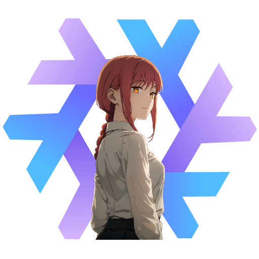

<h1 align="center">NixOS & Hyprland with Catppuccin Macchiato Theme Configuration</h1>

## 📖 About

This repository contains my NixOS Linux configuration with the Hyprland window manager and the Catppuccin Macchiato theme. Please note that this configuration is not minimalistic or lightweight and may require some disk space and knowledge to understand. If you're looking for something simpler, this configuration may not be suitable for you.

## 🌟 Showcase

[Showcase Video](home/Videos/Records/record.mp4)

## 🔧 Components

| Component             | Version/Name                |
|-----------------------|-----------------------------|
| Distro                | NixOS                       |
| Kernel                | Zen                         |
| Shell                 | Fish                        |
| Display Server        | Wayland                     |
| WM (Compositor)       | Hyprland                    |
| Bar                   | Waybar                      |
| Notification          | Dunst                       |
| Launcher              | Rofi-Wayland                |
| Editor                | Helix                       |
| Terminal              | WezTerm + Starship          |
| OSD                   | Avizo                       |
| Night Gamma           | Gammastep                   |
| Fetch Utility         | Neofetch                    |
| Theme                 | Catppuccin Macchiato        |
| Icons                 | Colloid-teal-dark, Numix-Circle |
| Font                  | JetBrains Mono + Nerd Font Patch |
| Player                | Spotify                     |
| File Browser          | Thunar                      |
| Internet Browser      | Qutebrowser, Brave + Vimium + NightTab |
| Mimetypes             | MPV, Imv, Zathura            |
| Image Editor          | Swappy                      |
| Screenshot            | Grim + Slurp                |
| Recorder              | Wf-recorder                 |
| Color Picker          | Hyprpicker                  |
| Clipboard             | Wl-clipboard + Cliphist + Clipboard-jh |
| Idle                  | Swayidle                    |
| Lock                  | Swaylock                    |
| Logout menu           | Wlogout                     |
| Wallpaper             | Wpaperd                     |
| Graphical Boot        | Plymouth + Catppuccin-plymouth |
| Display Manager       | Greetd + Tuigreet           |

And many other useful utilities. The full list can be found in the system configuration at `/nixos/configuration.nix` file.

## ✨ Features

- 🔄 **Reproducible**: Built on NixOS, this configuration can be effortlessly reproduced on other machines, ensuring a consistent setup.

- 🖌️ **Consistent**: Nearly every component has been meticulously styled to adhere to the Catppuccin Macchiato theme, providing a visually cohesive experience.

- ✅ **Complete**: This system is equipped with a wide range of components and utilities, akin to the completeness of operating systems like MacOS or Windows.

- 🎨 **Customizable**: Leveraging the power of Linux and Hyprland, this configuration offers extensive customization options, allowing you to tailor your setup to your preferences.

## 🚀 Installation

1. Download and Install NixOS from the [official site](https://nixos.org/download).
2. Temporarily install ripgrep and fish using the command: `nix-shell -p ripgrep fish --run fish`. You can also use classic bash and grep for the next step without installing fish and ripgrep.
3. Run the command `rg --hidden FIXME` and change/add lines to match your device, swaps, partitions, and file systems in the configuration files (`/etc/nixos/configuration.nix` & `/etc/nixos/hardware-configuration.nix`).
4. To change the default username and/or hostname, run the command `rg --hidden 'xnm'` to find and fix all instances of the username, and `rg --hidden 'isitreal-laptop'` for the hostname. Make sure to change the username to match yours to avoid login issues.
5. Copy all files (with replacements) from the `home` directory to your `$HOME` directory in Linux.
6. Copy all files (with replacements) from the `nixos` directory to `/etc/nixos/`. It's recommended not to copy and replace `hardware-configuration.nix`; only copy it if you have already change it for your hardware.
7. Run the command `sudo nixos-rebuild switch`. After this, you will have a complete system. You can also use flakes after first setup by running `sudo nixos-rebuild switch --flake .#` if needed.

## ⌨️ Keybindings

### Main

| Key Combination        | Action                      |
|------------------------|-----------------------------|
| ALT + R                | Resize windows mode          |
| ALT + M                | Move windows mode            |
| SUPER + H, J, K, L     | Change window focus         |
| SUPER + 1..0           | Change workspace             |
| SUPER + SHIFT + 1..0   | Move window to workspace     |
| SUPER + SHIFT + Q      | Kill active window           |
| SUPER + SHIFT + F      | Toggle floating window       |
| SUPER + CTRL + F       | Toggle full-screen           |
| SUPER + SHIFT + O      | Toggle split                 |
| SUPER + SHIFT + M      | Exit from hyprland           |
| SUPER + T              | Launch wezTerm               |
| SUPER + D              | Launch rofi -drun            |
| SUPER + B              | Launch qutebrowser           |
| SUPER + SHIFT + B      | Launch brave                 |
| SUPER + F              | Launch thunar                |
| SUPER + ESCAPE         | Launch wlogout               |
| SUPER + SHIFT + L      | Swaylock                     |
| SUPER + SHIFT + S      | Take screenshot              |
| SUPER + E              | Launch swappy to edit last taken screenshot |
| SUPER + R              | Record screen area (MP4)     |
| SUPER + SHIFT + R      | Record screen area (GIF)     |
| SUPER + C              | Color picker                |
| SUPER + V              | Launch clipboard menu (rofi -dmenu) |
| SUPER + X              | Launch clipboard deletion item menu (rofi -dmenu) |
| SUPER + SHIFT + X      | Clear clipboard             |
| SUPER + U              | Launch bookmark menu (rofi -dmenu) |
| SUPER + SHIFT + U      | Add text from clipboard to bookmark |
| SUPER + CTRL + U       | Launch bookmark deletion item menu (rofi -dmenu) |
| SUPER + SHIFT + A      | Toggle airplane mode        |
| SUPER + SHIFT + N      | Toggle notifications        |
| SUPER + SHIFT + Y      | Toggle bluetooth            |
| SUPER + SHIFT + W      | Toggle wifi                 |
| SUPER + P              | Toggle play-pause player    |
| SUPER + ]              | Player next track           |
| SUPER + [              | Player previous track       |

You can find all other keybindings in `/home/.config/hypr/hyprland.conf` in the bind section. All system fish scripts are located at `/home/.config/fish/functions` directory.

## 📜 License

This project is licensed under the MIT License - see the [LICENSE](LICENSE) file for details. 